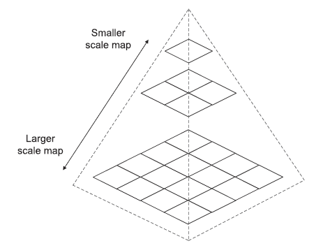
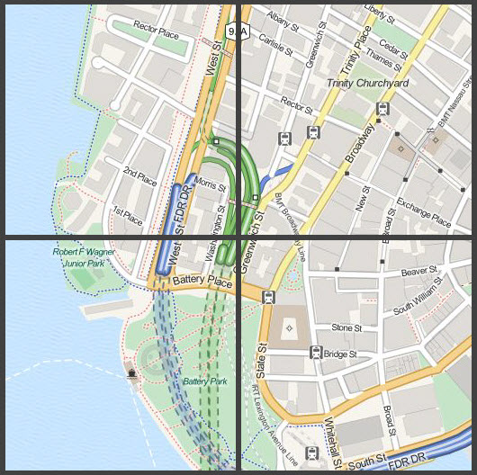
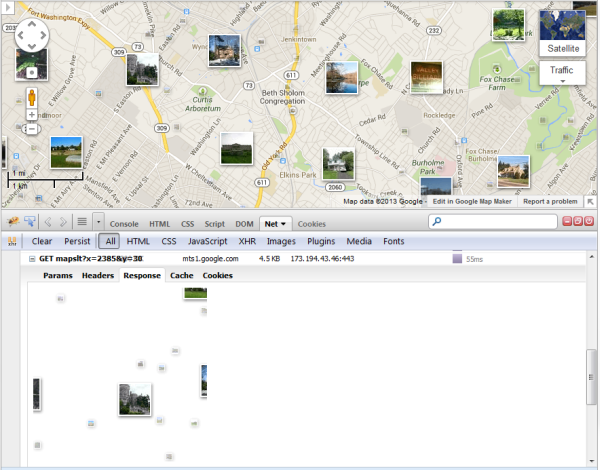
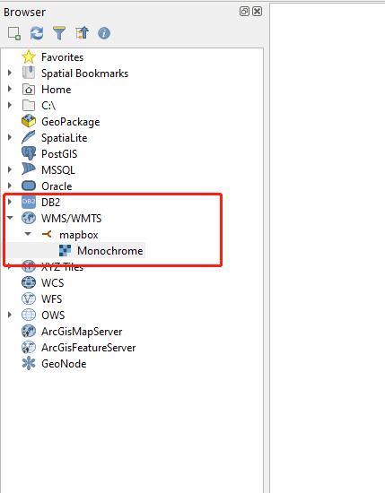
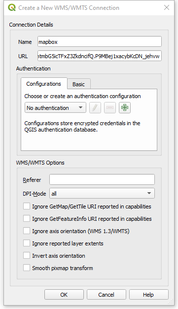
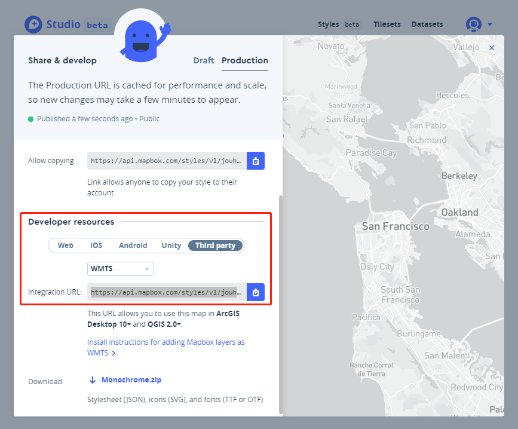
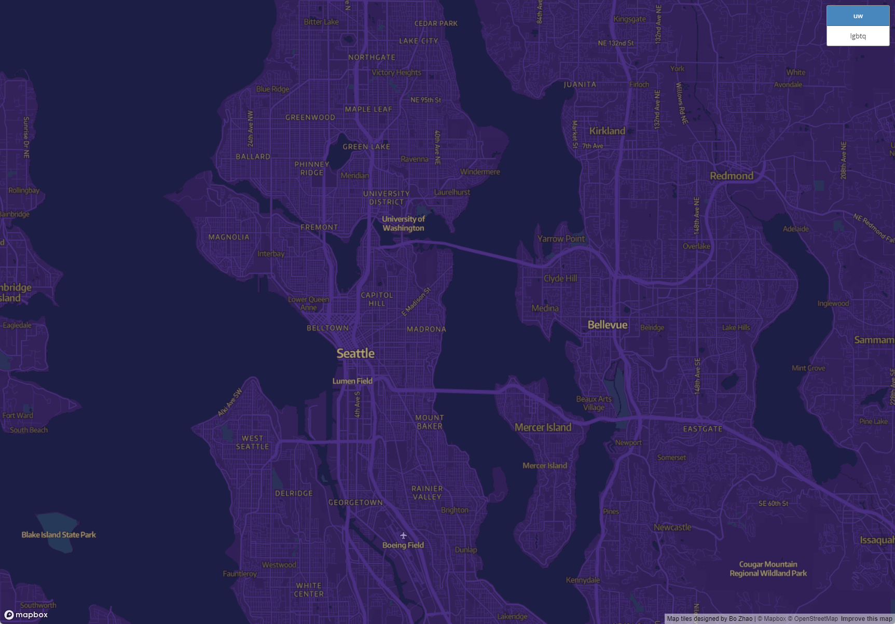

# Lab 4: Map Design and Tile Generation

**Instructor:** Bo Zhao, 206.685.3846 or zhaobo@uw.edu; **Points Available** = 50

The earliest web maps were typically drawn on the fly by the server, no matter how many layers were available or requested. As you may have noticed, **the symbol sets and labeling choices for this type of map are relatively limited and complex to work with**. In fact, for many years, web cartographers had to build a map with minimal layer set and simple symbols to avoid hampering performance. In many cases, a cartographer was not even involved; instead, the web map was made by a server administrator tweaking SLD files that defined the layer order, symbol sizes, and so forth. This was the case with both open specification web services (like WMS) and proprietary web services (like Esri ArcIMS).

In the mid-2000s, after Google Maps, Microsoft Virtual Earth (now Bing Maps), and other popular mapping applications hit the web, **people started to realize that maybe they didn't need the ability to tinker with the properties of every single layer**. These providers had started fusing their vector layers together in a single rasterized image that was divided into 256 x 256 pixel images, or tiles. These tiles were pregenerated and stored on disk for rapid distribution to clients. This was done out of necessity to support hundreds or thousands of simultaneous users, a burden too great for drawing the maps on the fly.

The figure below shows how a tiled map consists of a "pyramid" of images covering the extent of the map across various scales. Tiled maps typically come with a level, row, and column numbering scheme that can be shared across caches to make sure that tile boundaries match up if you are overlaying two tile sets.



> Tiled web maps take the form of a pyramid where the map is drawn at a progressive series of scale levels, with the smallest (zoomed out) scales using fewer tiles.

Cartographers loved the tiled maps, because now they could invest all the tools of their trade into making an aesthetically pleasing web map without worrying about performance. Once you had created the tiles, you just had a set of images sitting on disk, and the server could retrieve a beautiful image just as fast as it could retrieve an ugly one. And because the tiled map images could be distributed so quickly by a web server, Google and others were able to retrieve the tiles with no page blink as people panned.

Within a year or two of Google Maps' release, commercial GIS software began offering the ability to build map tiles. For many, ArcGIS Server was desirable because the map could be authored using the mature map authoring tools in ArcMap; however, cost was a concern for some. [Arc2Earth](https://www.arc2earth.com/) was another commercial alternative. The free and open source [Mapnik](http://mapnik.org/) library could also build tiles, but it wasn't until recent years that projects like [TileMill](https://tilemill-project.github.io/tilemill/) wrapped a user-friendly GUI around Mapnik.



> Credit: Tiles from OpenStreetMap data, rendered by MapQuest

Tiled maps were the only model that could reasonably work for serving complex web maps to thousands of simultaneous users. However, they eliminated the ability for users to change layer order or symbols. People started working around this by serving out their general-purpose basemap layers as tiles and then overlaying a separate layer with thematic information. The general-purpose basemap tiles could be re-used in many applications. The thematic layers could also be tiled if the data did not change too quickly or cover too broad an area at large scales. For example, if you examine Google Maps with a developer tool, you will see that the basemap and the thematic layers (such as Panoramio photographs) are both retrieved as tiles.



> The thematic layer of Panoramio photos is brought into Google Maps as predrawn tiles. This is evident when viewing the layer in Firebug.

## 2. Bing Tile System

The tile system of Microsoft Bing map is one of the earliest map tile system. To illustrate how the tile system work, I will focus on the Bing Tile system in this section. Bing Maps provides a world map that users can directly manipulate to pan and zoom. To make this interaction as fast and responsive as possible, Bing chose to pre-render the map at many different levels of detail, and to cut each map into tiles for quick retrieval and display. This section describes the projection, coordinate systems, and addressing scheme of the map tiles, which collectively are called the Bing Maps Tile System.

### 2.1 Map Projection

To make the map seamless, and to ensure that aerial images from different sources line up properly, we have to use a single projection for the entire world. We chose to use the **Mercator projection**, which looks like this:


Although the Mercator projection significantly distorts scale and area (particularly near the poles), it has two important properties that outweigh the scale distortion:

1.  It’s a **conformal** projection, which means that it preserves the shape of relatively small objects. **This is especially important when showing aerial imagery**, because we want to avoid distorting the shape of buildings. Square buildings should appear square, not rectangular.
2.  It’s a **cylindrical** projection, which means that **north and south** are always straight up and down, and west and east are always straight left and right.

Since the Mercator projection goes to infinity at the poles, it doesn’t actually show the entire world. Using a square aspect ratio for the map, the maximum latitude shown is approximately 85.05 degrees.

To simplify the calculations, we use the spherical form of this projection, not the ellipsoidal form. Since the projection is used only for map display, and not for displaying numeric coordinates, we don’t need the extra precision of an ellipsoidal projection. The spherical projection causes approximately 0.33% scale distortion in the Y direction, which is not visually noticeable.

### 2.2 Ground resolution and map scale

In addition to the projection, the ground resolution or map scale must be specified in order to render a map. At the lowest level of detail `Level 1`, the map is 512 x 512 pixels. At each successive level of detail, the map width and height grow by a factor of 2: Level 2 is 1024 x 1024 pixels, Level 3 is 2048 x 2048 pixels, Level 4 is 4096 x 4096 pixels, and so on. In general, the width and height of the map (in pixels) can be calculated as:

$$
map width = map height = 256 * 2^m pixels
$$

The **ground resolution** indicates the distance on the ground that’s represented by a single pixel in the map. For example, at a ground resolution of 10 meters/pixel, each pixel represents a ground distance of 10 meters. The ground resolution varies depending on the level of detail and the latitude at which it’s measured. Using an earth radius of 6,378,137 meters, the ground resolution (in meters per pixel) can be calculated as:

$$
ground resolution = cos(latitude * pi/180) * earth circumference / map width = (cos(latitude * pi/180) * 2 * pi * 6378137 meters) / (256 * 2^m pixels)
$$

The **map scale** indicates the ratio between map distance and ground distance, when measured in the same units. For instance, at a map scale of 1 : 100,000, each inch on the map represents a ground distance of 100,000 inches. Like the ground resolution, the map scale varies with the level of detail and the latitude of measurement. It can be calculated from the ground resolution as follows, given the screen resolution in dots per inch, **typically 96 dpi**:

$$
map scale = 1 : ground resolution * screen dpi / 0.0254 meters/inch  = 1 : (cos(latitude * pi/180) * 2 * pi * 6378137 * screen dpi) / (256 * 2^m * 0.0254)
$$


This table shows each of these values at each level of detail, **as measured at the Equator**. (Note that the ground resolution and map scale also vary with the latitude, as shown in the equations above, but not shown in the table below.)

| **Level of Detail** | **Map Width and Height (pixels)** | **Ground Resolution (meters / pixel)** | **Map Scale(at 96 dpi)** |
| ------------------: | --------------------------------: | -------------------------------------: | :----------------------- |
|                   1 |                               512 |                            78,271.5170 | 1 : 295,829,355.45       |
|                   2 |                             1,024 |                            39,135.7585 | 1 : 147,914,677.73       |
|                   3 |                             2,048 |                            19,567.8792 | 1 : 73,957,338.86        |
|                   4 |                             4,096 |                             9,783.9396 | 1 : 36,978,669.43        |
|                   5 |                             8,192 |                             4,891.9698 | 1 : 18,489,334.72        |
|                   6 |                            16,384 |                             2,445.9849 | 1 : 9,244,667.36         |
|                   7 |                            32,768 |                             1,222.9925 | 1 : 4,622,333.68         |
|                   8 |                            65,536 |                               611.4962 | 1 : 2,311,166.84         |
|                   9 |                           131,072 |                               305.7481 | 1 : 1,155,583.42         |
|                  10 |                           262,144 |                               152.8741 | 1 : 577,791.71           |
|                  11 |                           524,288 |                                76.4370 | 1 : 288,895.85           |
|                  12 |                         1,048,576 |                                38.2185 | 1 : 144,447.93           |
|                  13 |                         2,097,152 |                                19.1093 | 1 : 72,223.96            |
|                  14 |                         4,194,304 |                                 9.5546 | 1 : 36,111.98            |
|                  15 |                         8,388,608 |                                 4.7773 | 1 : 18,055.99            |
|                  16 |                        16,777,216 |                                 2.3887 | 1 : 9,028.00             |
|                  17 |                        33,554,432 |                                 1.1943 | 1 : 4,514.00             |
|                  18 |                        67,108,864 |                                 0.5972 | 1 : 2,257.00             |
|                  19 |                       134,217,728 |                                 0.2986 | 1 : 1,128.50             |
|                  20 |                       268,435,456 |                                 0.1493 | 1 : 564.25               |
|                  21 |                       536,870,912 |                                 0.0746 | 1 : 282.12               |
|                  22 |                     1,073,741,824 |                                 0.0373 | 1 : 141.06               |
|                  23 |                     2,147,483,648 |                                 0.0187 | 1 : 70.53                |


## 3 Generating Tiles in QGIS

In this section we will introduce how to load online map service as a map layer, and then convert the map layer as a tileset in QGIS 3. To do this, you need to install the QGIS plugin `QMetaTiles`.

To install the `QMetaTiles` Plugin, you need to click on `Plugins` on the main menu bar, and then `Manage and Install Plugins`. Then search for `QMetaTiles` and install the plugin. **For some version of QGIS, there is no plugin named `QMetaTiles`, Instead, you can use `QTiles`.**

Once you have the map layer or layer group ready, please change the displaying projection to **Pseudo Mercator**, the epsg code is 3857. It is because most web maps are projected in the Pseudo Mercator. If you want to overlay any tiles with other external map services, you need to make sure all the displaying map layers are in the same projection.


### 3.1 Load a Map Layer from Mapbox Studio

You can load individual map layers from Mapbox Studio styles. What's more, you can even make a layer group that is made up by several different layers. This section will walkthrough how to read map layers from Mapbox's Tile Services.



If you need a guide to make your own MapBox maplayer, you can refer to [this Mapbox Studio Guide](https://docs.mapbox.com/studio-manual/overview/). After creating your own map, open the browser panel in QGIS. Scroll Down to the **'WMS/WMTS'**, right click, and click **'New Connection'**. A pop-up window should appear.



Here, you can make a new connection to basemaps by providing the URL. In order to obtain the URL to your mapbox basemap, click `share` located next to your map on MapBox Studio:



Make sure you pick Third party option and copy the Integration URL of `WMTS` like the example above. After establishing the connection, you should be able to add your basemap by double-clicking the newly created connection.

Zoom into your tiles so that they fill most of the canvas space. **The canvas extent is the extent we will use to generate QMetaTiles.**

### 3.3 Generating Tiles by QMetaTiles (or QTiles)

Click the Plugins drop down, hover over QMetaTiles to open the menu and select it. The QMetaTiles screen pops up. **For some version of QGIS, there is no plugin named QMetaTiles, Instead, you can use QTiles.** Name the directory where you want to save your tiles and provide a name for the Tileset. Select Canvas Extent and Zoom levels. In the Parameters make the **'Background transparency'** clear by changing the value to zero. Click Ok.


> Note: the runtime is dependent on the size and number of zoom levels. Please do not select the `use TMS tile convertion` option.

The file directory will contain your QMetaTiles and an HTML document that can be integrated with `leaflet` if you checked "Write Leaflet-based viewer". Additional help with QMetaTiles can be found **[here](http://felix.rohrba.ch/en/2017/easily-add-tilemap-layers-qgis/)**. The leaflet map will help you view the map tiles. But for your own deliverable, you need to load the maps using [Mapbox GS JS](https://docs.mapbox.com/mapbox-gl-js/api/).

### 3.4 Navigate to QMetaTiles folder

Navigate to the output file after QMetaTiles finishes running. In this folder will be your sub folders of tiles arranged by zoom level, and an html document if you checked "Write Leaflet-based viewer" when generating tiles in QGIS.

Open the html and look at the source code. To load the layers, you can refer to the code below. 

```javascript
map.addSource('sample-tiles', {
    'type': 'raster',
    'tiles': [
        'http://{s}.somedomain.com/{foo}/{z}/{x}/{y}.png'
    ],
    'tileSize': 256,
    'attribution': 'Map tiles designed by Bo Zhao</a>'
});

map.addLayer({
    'id': 'sample-layer',
    'type': 'raster',
    'layout': {
        'visibility': 'none'
    },
    'source': 'sample-tiles'
});
```

In the code above, `{s}` means one of the available subdomains (used sequentially to help with browser parallel requests per domain limitation; subdomain values are specified in options; a, b or c by default, can be omitted), `{z}` — zoom level, `{x}` and `{y}` — tile coordinates. `{r}` can be used to add "@2x" to the URL to load retina tiles.


## 4 Add map tiles to a MapBox Map

For web mapping and geovisualization applications, the QMetaTiles folder generated above in QGIS (the folder that holds all tiles at different zoom levels) should be placed in your assets folder of your repository. To get a starter code for the map, you can refer to [the class materials in week 4](https://github.com/jakobzhao/geog458/tree/master/weeks/week04). You can refer to the code below as an example for add the files as a map layer. **In the code you will need to use relative path names.**

```js

map.on('load', () => { //simplifying the function statement: arrow with brackets to define a function

  map.addSource('uw-tiles', {
      'type': 'raster',
      'tiles': [
          'assets/uw/{z}/{x}/{y}.png'
      ],
      'tileSize': 256,
      'attribution': 'Map tiles designed by Bo Zhao</a>'
  });

  map.addLayer({
      'id': 'uw',
      'type': 'raster',
      'layout': {
          // 'visibility': 'none'
        	// Uncomment the line above will hide this map layer at first.
        	// This will be useful when you have multiple layers added to your map.
      },
      'source': 'uw-tiles'
  });


});
```

As shown by the code, the tiles are loaded from a relative path `assets/[tilesets]` which exists at a location in your internal network. For the following parameters in the path: `{z}` indicates zoom level, `{x}` and `{y}` are tile coordinates. 

[Here](http://jakobzhao.github.io/geog458/labs/lab04/index.html) is what the final output looks like. The source code for the map can be found [here](index.html). The source code include the additional code for adding a layer switcher, as shown at the upper right corner of the screenshot below.



## 5 Deliverable

- You are expected to generate **four** tile sets of any geographic phenomena you are interested in, and assemble all the layers to a mapbox made out of Mapbox gs js. **Since github repository only allows you upload a limited amount of data, so please make sure not to generate too many tiles by limiting the boundingbox or the scale range.** This lab is an opportunity to make a basemap or thematic map layers for your final project. Below are the lab requirement.

  - The first tile set should be a base map provided by MapBox. **Please make sure it is a basemap rather than a thematic map.** In most web map applications, Basemap is overlain with other thematic map layers and/or interactive features. Its primary function is to illustrate the geographical context of the study area. Therefore, a basemap is usually made in a monochrome color scheme. You are encouraged to make your basemap directly out of the existing map layers provided by MapBox (like those monochrome map layers provided on MapBox Studio). However, please make sure to change at least a few color uses, icons, and the label font. Overall, even you made a few changes, the base map should still look visually appealing. (5 POINTS).

  - The second tile set should be a thematic layer made by your own geospatial dataset. (5 POINTS).

  - The third tile set should be composed of a thematic layer (from the second tile set) and a basemap from the first tile set, as the map tiles shown in Section 4. (5 POINTS).

  - The fourth tile set should be a map layer designed over Mapbox. It should embody a map theme relevant to your research interests, which, for instance, could be Black History month, LGBTQ+ Pride, UW, Nature/Environment, etc. Please try to use the color, icon, and label to realize the theme.  (5 POINTS). 

> An example can be found from [here](https://ramouj.github.io/Map-Tile-Generation/index.html). Although the map library of this example is leaflet, but you can refer the map this student has designed as an example. You need to make the maps using Mapbox GS JS.

-  After the map tiles are generated, you are expected to create an index.html to visualize the four tile map sets.
    -  create any necessary web page elements, such as page/map title, scale bar, attribution, zoom control, map description, etc. (5 POINTS)
    -  The map should be shown in the full screen. (5 POINTS).
    -  A layer switcher should be added to allow users to turn on and off each map layers.. (6 POINTS).

-  Upload everything to a github repository. In the `readme.md` file of this repository, please briefly introduce

    -  the url to access the web map you have made.
    -  screenshots of the four layers (2 POINTS)
    -  the examined geographic area, and (2 POINTS)
    -  the available zoom levels of each tile set (2 POINTS), and
    -  brief descriptions of each tile sets (3 POINTS).

- make sure the repository accessible through the url `https://[your_github_username].github.io/[your_repository_name]`. Also, please provide the url to your webmap in the `readme.md` file. (5 POINTS).

The structure of this repository should look like:

```powershell
[your_repository_name]
    │readme.md
    │index.html
    ├─assets
    │      [tile sets 1]
    │         XXX
    │         XXX
    │      [tile sets 2]
    │         XXX
    │         XXX
    │      [tile sets 3]
    │         XXX
    │         XXX
    │      [tile sets 4]
    │         XXX
    │         XXX
```

## Extended Readings

-   Vector Tiles: <http://docs.geoserver.org/latest/en/user/extensions/vectortiles/tutorial.html>
-   3D Tiles: <https://github.com/AnalyticalGraphicsInc/3d-tile>

## References:

1.  <https://www.e-education.psu.edu/geog585/node/706>
2.  <https://docs.microsoft.com/en-us/bingmaps/articles/bing-maps-tile-system>
