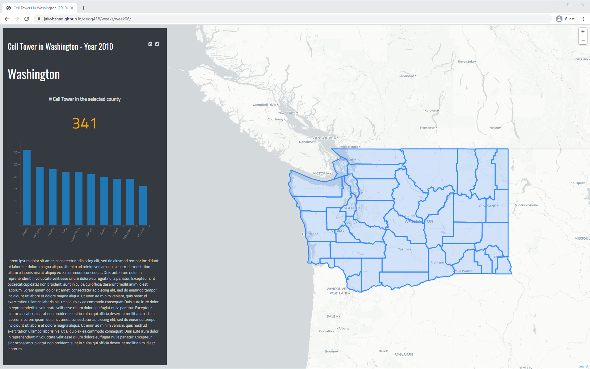

## Creating A Smart Dashboard

In this lecture, we will introuduce how to make a smart dashboard using javascript. A smart dashboard is frequently used to provide a coordinated view of multiple visual compoanents (e.g., maps, charts, texts, tables, diagrams) to holistically present the a (geographical) event. For example, one of the most popular use of smart dashboard is to visualize the trend of COVID-19 (refer to https://hgis.uw.edu/virus). Since map is an essential component for most smart dashboard applications, it has been considered as a very imporant type of digital geographies project.

In order to show how to create a smart dashboard, we wil walk through a smart dashboard together. This dashboard illustrates the descriptive statistics of cell towers in each county Washington State in the year of 2021. You can review the final look of this dashboard at [here](https://jakobzhao.github.io/geog458/weeks/week06/index.html).


As shown, it is composed of two panels - a side bar panel and a main window. The main window shows a map of counties in Washington state, while the side bar illustrates the project tile, social media bottons, the examined county, the number of cellt towers in that examined county, a bar chart illustrating the top 10 counties containing the most cell towers, and a footer. As smart dashboard, the map, text, and the chart are coordinated. By saying so, whenever triggering an event of one visual component (e.g. map or chart), other components on the dashboard can react correspondingly.

## 1. Preparation

As most of the labs and lecture assignments, we need to create an empty github repo, and then clone the repo to your local computer using the command utilty `git clone [repo-https-url]`. By doing so, you can code on a IDE such as atom on your local computer. You can find all the relevant files under the **week06** folder of the course repo. In the folder, we have downloaded the necessary libraries and stylesheets, and when you create your repo structure, please always follow the structure tree below.

```powershell
[your_repository_name]
    │index.html
    │readme.md
    │
    ├─assets
    │      wacountydata.geojson
    │
    ├─css
    │      main.css
    │
    ├─img
    │      xxx.jpg
    │
    ├─js
    │        main.js
```

In the meantime, please relocate the c3.min.css, leaflet.css to your css folder, while the c3.min.js, d3.js, jquery.min.js and leaflet.js to your js folder.
